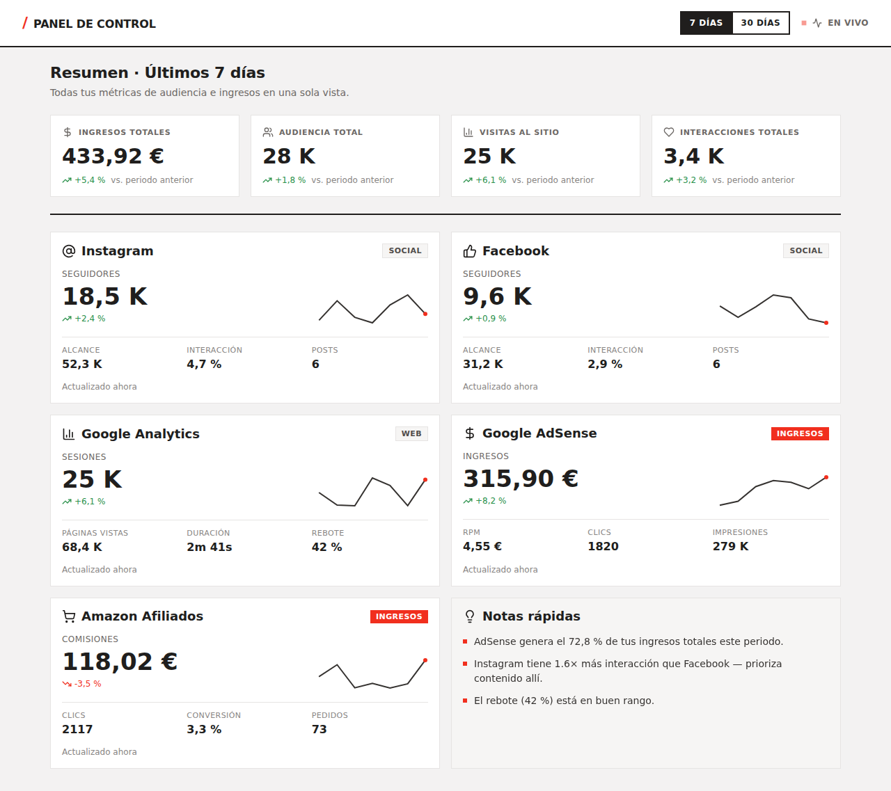

# Panel de Control Multicanal

Dashboard que centraliza en una sola vista las métricas de **Instagram, Facebook,
Google Analytics, Google AdSense y Amazon Afiliados**, con filtro de periodo
(7 / 30 días), indicador "En vivo" y notas automáticas de insights.

Recreación en stack real (**React + Vite + TypeScript**) del prototipo de diseño
`Dashboard.dc.html`, siguiendo el sistema de diseño **Modernist** (rojo `#ec3013`
sobre blanco/negro, tipografía Archivo, esquinas a 0 px, reglas de 2 px).



---

## Puesta en marcha

```bash
npm install
npm run dev        # http://localhost:5173
npm run build      # type-check (tsc) + build de producción
npm run preview    # sirve el build
```

Requisitos: Node ≥ 18.

---

## Arquitectura

```
src/
├── data/
│   ├── types.ts          Modelos de dominio normalizados (lo que consume la UI)
│   ├── api.ts            Frontera de datos: fetchDashboard() + provider activo
│   ├── mockProvider.ts   Provider de desarrollo (datos simulados, mismas formas)
│   ├── channelConfig.tsx Icono / título / tag por canal
│   ├── format.ts         Formateo locale es-ES (números, moneda, %, duración)
│   └── relativeTime.ts   "hace 2 min" para lastSyncedAt
├── hooks/
│   └── useDashboard.ts   Estado de periodo + carga + polling + cancelación
├── components/           Nav, KpiCard, ChannelCard, Sparkline, NotesCard, ...
└── styles/
    ├── tokens.css        Tokens del sistema Modernist (colores OKLCH, espaciado)
    └── global.css        Reset + animaciones
```

**Principio clave:** la UI nunca habla con una API de canal directamente. Llama a
`fetchDashboard(period)`, que delega en un *provider* y devuelve un
`DashboardSnapshot` ya normalizado. Hoy ese provider es `mockProvider`; para ir a
producción se sustituye por un `httpProvider` que llame a **tu backend**.

### Estado por canal

Cada tarjeta se renderiza según su `status` (`connected | loading | error |
disconnected`), de modo que **si una API falla, solo cae esa tarjeta** (con
mensaje + botón de reintento), no el panel completo. La carga inicial muestra
skeletons.

---

## Integración real (backend)

> ⚠️ **Todas las llamadas a las APIs de canal deben hacerse en el servidor.** El
> navegador solo habla con *tu* backend (p. ej. `GET /api/dashboard?period=7d`),
> que guarda los tokens OAuth y aplica la caché recomendada (5–15 min) para no
> exceder cuotas. Nunca envíes secretos de Meta / Google / Amazon al cliente.

### Backend ya provisionado (Supabase)

El backend vive en el proyecto Supabase **wtj-barbershop**, en un schema aislado
`panel` (no toca el schema `public` de esa app):

- **`panel.connections`** — tokens OAuth por usuario+canal. Solo `service_role`.
- **`panel.snapshots`** — caché de `DashboardSnapshot` por usuario+periodo (TTL 10 min).
- **`panel.amazon_imports`** — datos manuales de Amazon Afiliados.
- **Edge Function `dashboard`** — `GET /functions/v1/dashboard?period=7d|30d`;
  aplica la caché y, autenticada, re-sincroniza. Código en
  `supabase/functions/dashboard/index.ts`.

Las tablas tienen RLS habilitada **sin políticas permisivas**: el navegador
nunca las lee; solo la Edge Function (service_role) accede.

**Para que el frontend consuma el backend real:**

```bash
cp .env.example .env   # ya trae la URL + clave anon públicas del proyecto
npm run dev
```

`src/data/api.ts` elige automáticamente `httpProvider` (Supabase) cuando
`VITE_SUPABASE_URL` y `VITE_SUPABASE_ANON_KEY` están definidas, y `mockProvider`
si no lo están. No hay que tocar código.

> **Estado actual:** la Edge Function devuelve un snapshot de *demostración*
> calculado server-side (mismo formato que el real). El paso que falta para datos
> 100 % reales es rellenar `syncSnapshot()` con las llamadas OAuth a cada canal
> (marcado con `TODO` en el código). La UI y el contrato de datos no cambian.

### Integraciones pendientes por canal

El backend es responsable de mapear cada respuesta cruda a los modelos
normalizados. Resumen de integraciones:

| Canal | API | OAuth / scopes | Endpoints / métricas |
|-------|-----|----------------|----------------------|
| **Instagram** | Instagram Graph API (Meta) | `instagram_basic`, `instagram_manage_insights`, `pages_show_list`, `pages_read_engagement` | `GET /{ig-user-id}/insights` (reach, impressions, engagement), `/media`, `?fields=followers_count`. Cuenta Business/Creator vinculada a Página. Token de larga duración (60 d, requiere refresco). |
| **Facebook** | Meta Graph API (Página) | `pages_read_engagement`, `pages_show_list`, `read_insights` | `GET /{page-id}/insights` (`page_impressions`, `page_engaged_users`), `/posts`. |
| **Google Analytics** | GA4 Data API | `analytics.readonly` | `POST properties/{property-id}:runReport` con `sessions`, `screenPageViews`, `averageSessionDuration`, `bounceRate`. `property-id` se pide en el onboarding. |
| **Google AdSense** | AdSense Management API | `adsense.readonly` | `GET accounts/{account}/reports:generate` con `ESTIMATED_EARNINGS`, `CLICKS`, `IMPRESSIONS`, `PAGE_VIEWS_RPM`. Verificar elegibilidad de la cuenta. |
| **Amazon Afiliados** | — | — | ⚠️ **No hay API pública de métricas de comisiones en tiempo real.** PA-API solo sirve catálogo/precios. Opciones: (a) subida periódica de CSV exportado del panel de Asociados, o (b) ingresos como entrada manual. Documentar esta limitación al usuario. |

### El indicador "En vivo"

En el prototipo, "En vivo" re-generaba valores aleatorios cada 3 s. Aquí eso se
sustituye por **polling real** del backend (`POLL_INTERVAL_MS` en
`useDashboard.ts`, 30 s por defecto) sobre datos cacheados. Para actualizaciones
push, el backend podría exponer webhooks / SSE y el hook suscribirse en lugar de
sondear.

---

## Sistema de diseño (Modernist)

Los tokens viven en `src/styles/tokens.css`:

- **Color:** fondo `#f3f2f2`, texto `#201e1d`, acento `#ec3013`; rampas
  neutral/acento 100–900 en OKLCH.
- **Tipografía:** Archivo (Google Fonts).
- **Espaciado:** 4, 8, 12, 16, 24, 32 px (`--space-1`…`--space-8`, sin 5/7).
- **Radios:** 0 px en todo. **Reglas:** `.hr` de 2 px; divisores de tarjeta 1 px.
- **Iconos:** Lucide (`lucide-react`).

Ajustar la marca solo requiere editar `tokens.css`; ningún componente hardcodea
colores.
